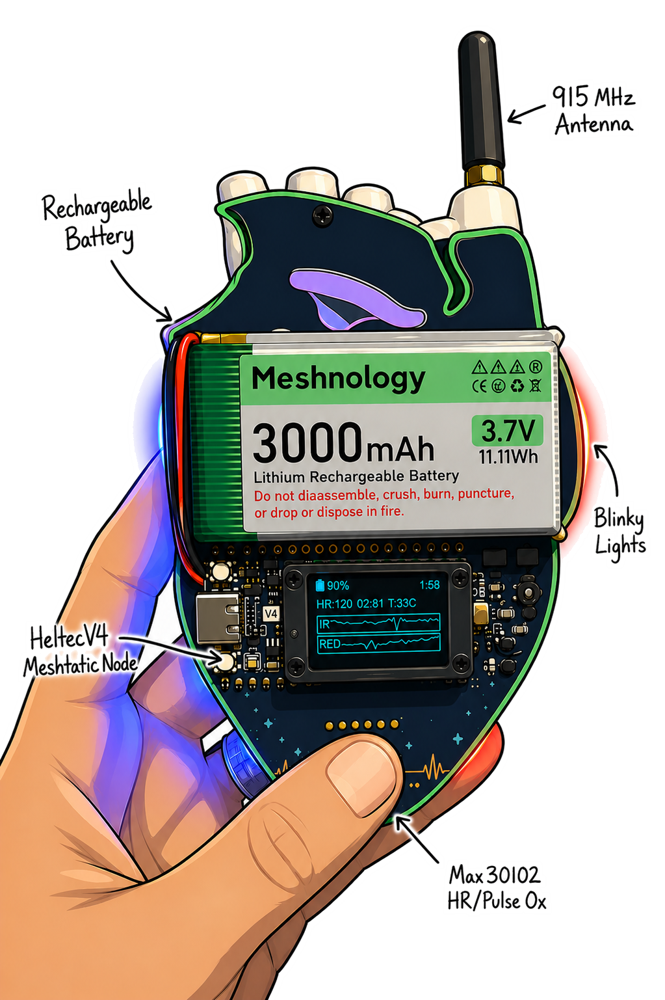

# Biohacking Village DEF CON 2026 Badge — Hardware

KiCad PCB design files for the BHV badge: a wearable, off-grid messenger with a pulse sensor and a heartbeat made of light. Badge holders chat across a private LoRa mesh, exchange direct "heart to heart" messages, and personalize how their badge reacts to people and conversations around them.

Designed for **DEF CON 2026**.

  

## Key Components

| Reference | Component | Purpose |
|-----------|-----------|---------|
| D1–D14 | WS2812B addressable LEDs (×14) | Heartbeat animation and notification pulses |
| J1 | Heltec WiFi LoRa 32 V4 | ESP32-S3 MCU + SX1262 LoRa radio |
| J2 | GY-MAX30102 header | Heart rate / SpO2 optical sensor |
| U1 | TPS61040DDC | Boost converter |
| Q1 | 2N7002H | N-channel MOSFET |
| Q2 | DMP2012SN | P-channel MOSFET |

Full BOM: [`bhvBadge2026/bhvBadge2026.csv`](bhvBadge2026/bhvBadge2026.csv)

## Repo Contents

- `bhvBadge2026/` — KiCad project (schematic, PCB layout, BOM)
- `bhvBadge2026/bhvBadge2026.step` — 3D model of the assembled board
- `bhvBadge2026/3D Models/` — Bambu Studio project for the badge enclosure

## Firmware

Badge firmware lives in a separate repo: [bhv_meshtastic](https://github.com/nathantsmith/bhv_meshtastic)

## License

[MIT](LICENSE)
